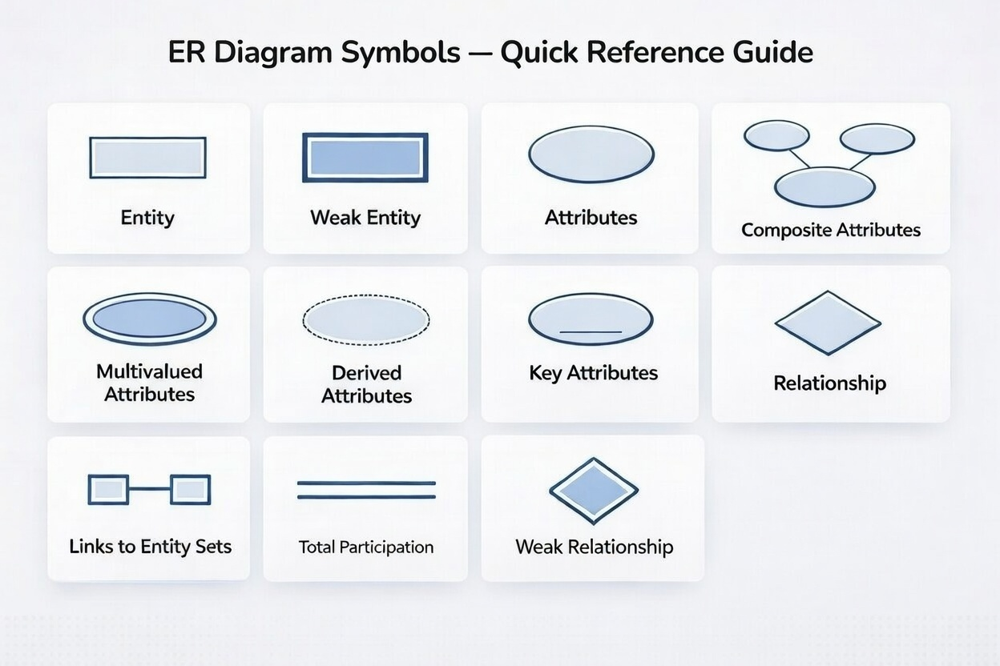

## ER Diagram Symbols: The Visual Vocabulary of Database Design

> সিস্টেম ডিজাইনের শুরুতে ডেটার স্ট্রাকচার এবং রিলেশনশিপ বোঝানোর জন্য আমরা এই সিম্বলগুলো ব্যবহার করি। প্রতিটি চিহ্নের পেছনে সুনির্দিষ্ট লজিক কাজ করে।

### ১. Core Building Blocks (এনটিটি এবং রিলেশনশিপ)

এগুলো হলো ডায়াগ্রামের মূল কাঠামো যা নির্ধারণ করে সিস্টেমটি আসলে কী নিয়ে কাজ করছে।

| সিম্বল               | নাম               | ব্যাখ্যা                                                                                                  |
| :------------------- | :---------------- | :-------------------------------------------------------------------------------------------------------- |
| **Rectangle**        | Entity            | এটি একটি স্বতন্ত্র অবজেক্ট (যেমন: User বা Product)। এটি ফিজিক্যাল মডেলে একটি টেবিলে রূপান্তরিত হয়।        |
| **Double Rectangle** | Weak Entity       | এমন একটি এনটিটি যা অন্য একটি এনটিটির ওপর পুরোপুরি নির্ভরশীল। যেমন: Invoice_Item, যা Invoice ছাড়া অর্থহীন। |
| **Diamond**          | Relationship      | দুটি এনটিটির মধ্যে লজিক্যাল কানেকশন (যেমন: User Places Order)।                                            |
| **Double Diamond**   | Weak Relationship | এটি একটি Weak Entity-কে তার "Identifying" বা প্যারেন্ট এনটিটির সাথে যুক্ত করে।                            |

### ২. Defining Attributes (ডেটা প্রোপার্টিজ)

এনটিটির ভেতর কী কী ডেটা থাকবে তা এই সিম্বলগুলো দিয়ে প্রকাশ করা হয়।

- **Ellipse (Attribute)**: সাধারণ ফিল্ড বা কলাম বোঝায় (যেমন: Name, Status)।
- **Underlined Ellipse (Key Attribute)**: এটি হলো Primary Key। এটি ডেটাবেজে প্রতিটি রো-কে ইউনিকলি আইডেন্টিফাই করে।
- **Nested Ellipses (Composite Attribute)**: যখন একটি ফিল্ডকে কয়েক ভাগে ভাগ করা যায় (যেমন: Address থেকে City, Zip)।
- **Double Ellipse (Multivalued Attribute)**: যখন একটি কলামে একাধিক ভ্যালু থাকতে পারে (যেমন: Phone_Numbers)। ফিজিক্যাল মডেলে এগুলোকে সাধারণত আলাদা টেবিলে নিয়ে যেতে হয়।
- **Dashed Ellipse (Derived Attribute)**: এই ডেটা সরাসরি স্টোর করা হয় না, অন্য ডেটা থেকে ক্যালকুলেট করা হয় (যেমন: DOB থেকে বের করা Age)।

### ৩. Structural Connections (কানেকশন)

এনটিটিগুলো একে অপরের সাথে কতটা দৃঢ়ভাবে যুক্ত তা এখান থেকে বোঝা যায়।

- **Single Line (Link)**: এনটিটির সাথে তার অ্যাট্রিবিউট বা রিলেশনশিপের সাধারণ সংযোগ।
- **Double Line (Total Participation)**: এর মানে হলো, ওই এনটিটি সেটের প্রতিটি মেম্বারকে অবশ্যই রিলেশনশিপে অংশ নিতে হবে।
  Dev Note: এটি ডেটাবেজ লেভেলে NOT NULL ফরেন কি (FK) কনস্ট্রেইন্ট নিশ্চিত করে।

নোটঃ

    ১. Normalization: Multivalued attributes দেখলে সরাসরি সেগুলোকে আলাদা টেবিলে রিফ্যাক্টর করার কথা ভাবতে হবে।

    ২. Performance: Derived attributes যেন অ্যাপ্লিকেশনের পারফরম্যান্স স্লো না করে, প্রয়োজনে এগুলোকে মেমোরিতে ক্যালকুলেট করতে হবে।
